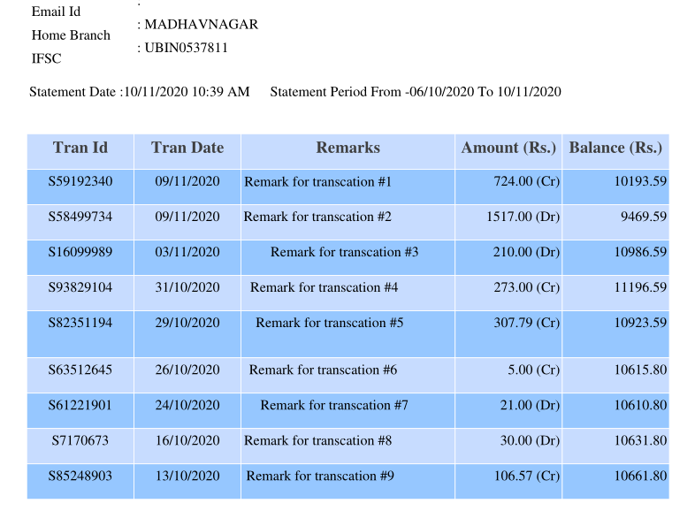
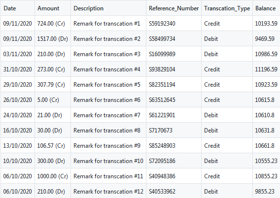

# Bank-Statement-Extraction
The app is designed to extract bank statement table and output the CSV for the same.



## About the data
The PDF has list of my transcations from 6th Oct to 10th Nov. The data is masked in PDF for privacy and security reasons.
 
## Getting started with tabula
This module is a wrapper of tabula, which enables table extraction from a PDF.

This module extracts tables from a PDF into a pandas DataFrame. Currently, the implementation of this module uses subprocess.

### Running on your station
Recommend using [Anaconda](https://www.anaconda.com/distribution/). Anaconda does not come with tabula, so you will need to install those seperately. 
```
pip install tabula-py
```
For additional information on installing Tabula: [Documentation](https://tabula-py.readthedocs.io/en/latest/tabula.html), [PyPi](https://pypi.org/project/tabula-py/)


### Running Python App
From command line navigate to your application's directory and use:
```
python main.py --File statement_masked.pdf --Output transcation_table.csv
```

